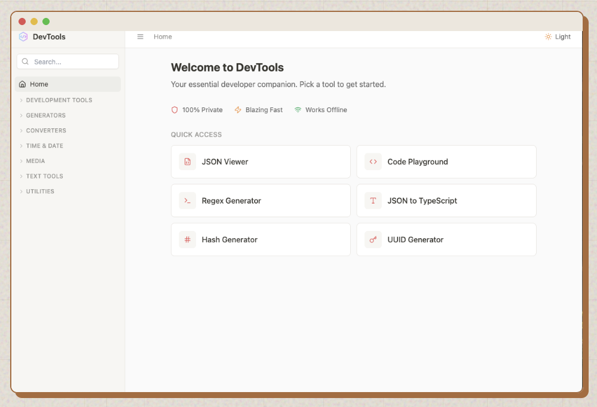

# DevToolsApp Desktop

Offline-first developer utilities for macOS, Windows, and Linux. No cloud dependencies, no data collection.



## Features

### Text & Code

- **JSON Viewer** - Format, validate, and minify JSON with syntax highlighting
- **API Response Formatter** - Format REST/GraphQL responses with interactive tree view and real-time search
- **Text Compare** - Diff viewer with line-by-line comparison
- **Case Converter** - Transform between camelCase, snake_case, kebab-case, and more
- **Markdown Editor** - Live preview with export support
- **Code Playground** - Multi-language editor (JS, HTML, CSS, JSON, Markdown)

### Converters

- **Base64** - Encode/decode text and files
- **URL Encoder** - Encode/decode URLs and URI components
- **CSV ↔ JSON** - Bidirectional conversion with custom delimiters
- **JSON → TypeScript** - Generate TypeScript interfaces from JSON
- **Number Base** - Convert between decimal, binary, octal, hex
- **Unit Converter** - Convert length, weight, temperature & currency units

### Generators

- **UUID Generator** - Generate v1/v4/v6/v7 UUIDs and ULIDs with batch support
- **Password Generator** - Generate secure passwords and passphrases with strength analysis
- **Hash Generator** - MD5, SHA-1, SHA-256, SHA-512
- **QR Generator** - Generate QR codes with custom size and error correction
- **Color Palette** - Create monochromatic, analogous, complementary schemes
- **Lorem Generator** - Generate placeholder text

### Developer Utilities

- **JWT Decoder** - Decode and inspect JWT tokens
- **Regex Generator** - Interactive regex construction with live testing
- **Cron Calculator** - Build cron expressions with plain English descriptions
- **Timestamp Converter** - Unix timestamp conversion with multiple formats
- **Date Difference** - Calculate difference between two dates
- **Image Converter** - Convert between PNG, JPEG, WebP, BMP

## Download

Get the latest release for your platform:

- **[macOS (Intel)](https://github.com/me-shaon/devtools/releases/latest/download/DevToolsApp-macos-x64.dmg)**
- **[macOS (Apple Silicon)](https://github.com/me-shaon/devtools/releases/latest/download/DevToolsApp-macos-arm64.dmg)**
- **[Windows](https://github.com/me-shaon/devtools/releases/latest/download/DevToolsApp-windows-setup.exe)**
- **[Linux](https://github.com/me-shaon/devtools/releases/latest/download/DevToolsApp-linux.AppImage)**

### macOS Release Note

GitHub release builds are intended to be signed and notarized. If you run a local unsigned build for testing, macOS may still show a security warning until you sign it with your Apple Developer certificate.

## Quick Start

```bash
# Clone and install
git clone https://github.com/me-shaon/devtools.git
cd devtools
npm install

# Run locally (development mode)
npm run dev

# Build for distribution
npm run dist
```

## Requirements

- Node.js 18+
- npm or yarn

## Architecture

```
src/
├── components/
│   └── tools/       # Tool implementations (24 React components)
├── app/
│   └── DevToolsApp.tsx   # Main app with sidebar navigation
└── main.tsx         # React entry point

src-electron/
├── main.ts          # Electron main process
└── preload.ts       # Secure IPC bridge
```

### Tech Stack

- **Electron** 40+ for desktop runtime
- **React** 18+ with TypeScript
- **Vite** for fast builds and hot reload
- **Tailwind CSS** for styling
- **shadcn/ui** for UI components
- No analytics or telemetry

## Development

### Running in Development

```bash
npm run dev    # Starts Vite dev server + Electron
```

### Build Scripts

```bash
npm run dev              # Development mode with hot reload
npm run build            # Build React app + Electron
npm run dist             # Create installers for all platforms
npm run dist:publish     # Build and publish to GitHub releases
```

## Adding a Tool

1. Create component in `src/components/tools/YourTool.tsx`
2. Add tool definition to `ALL_TOOLS` array in `src/app/DevToolsApp.tsx`
3. Add render case in the `renderTool()` switch statement
4. That's it! The tool will appear in the sidebar automatically

## Contributing

We welcome contributions! This project is continuously being improved by user feedback and contributions.

### Pull Requests

Pull requests welcome. For major changes, open an issue first to discuss the proposed changes.

### Development Setup

```bash
git clone https://github.com/me-shaon/devtools.git
cd devtools
npm install
npm run dev  # Run in development mode
```

## License

MIT
